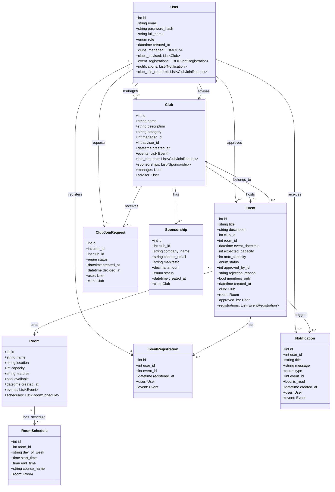
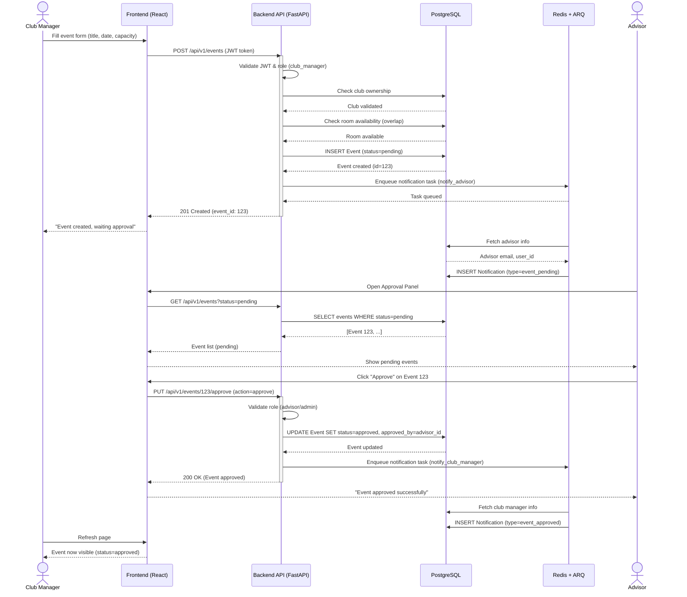
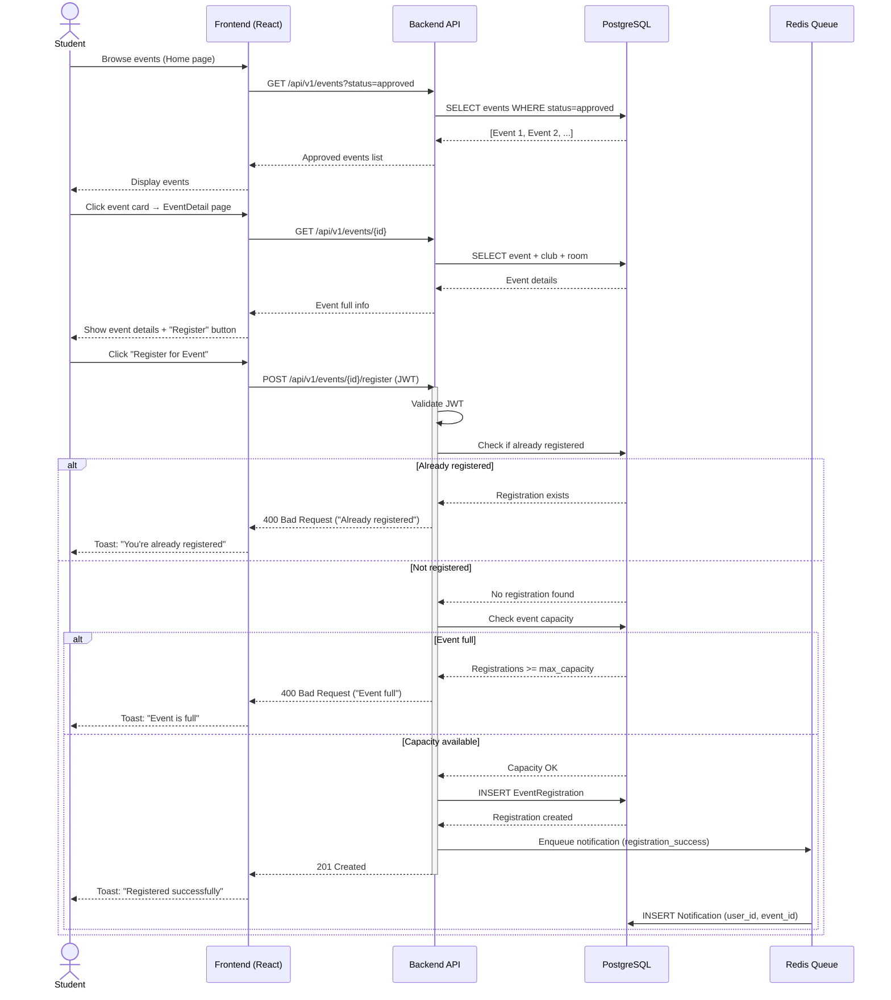
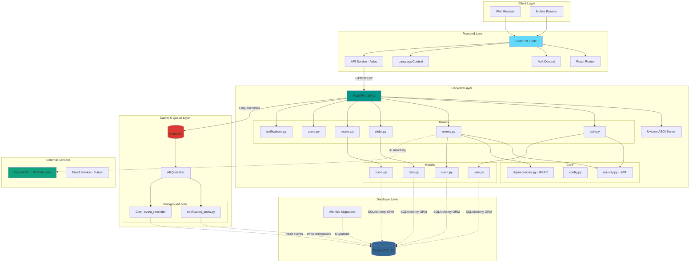
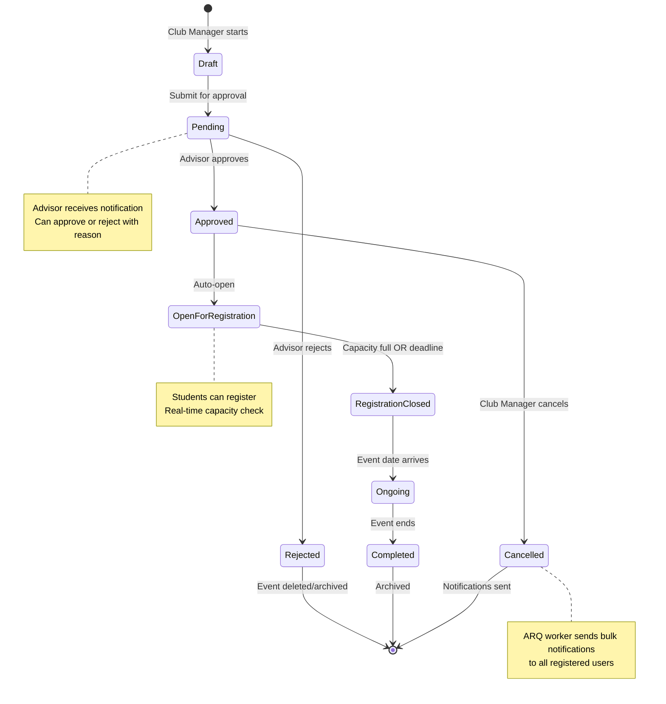
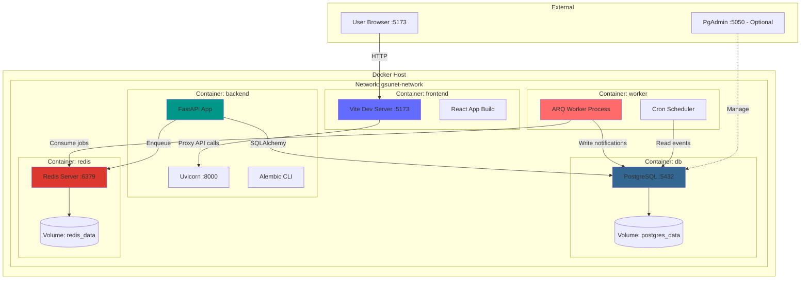
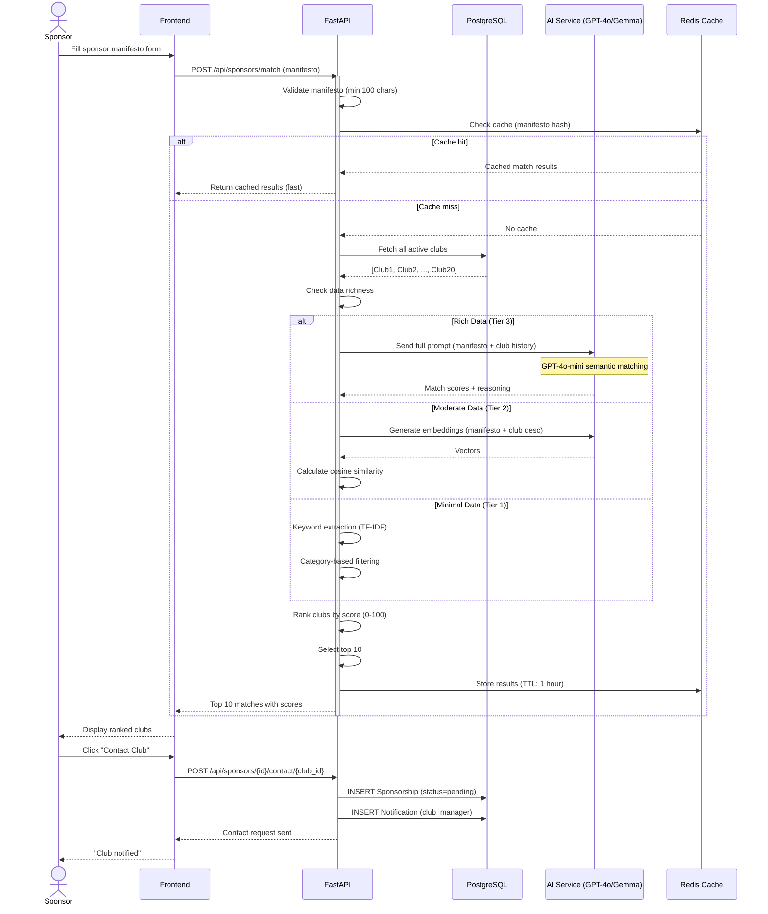

# GSUNET - UML Diyagramları (Mermaid Format)

**Tarih**: 2025-12-19
**Kaynak**: Review5 code analysis + Backend models/routes
**Format**: Mermaid (mermaid.live veya LaTeX mermaid package ile render edilebilir)

---

## 1. CLASS DIAGRAM - Database Models (En Önemli)

Bu diyagram SQLAlchemy modellerini ve aralarındaki ilişkileri gösterir.



**Render için**: https://mermaid.live/

---

## 2. SEQUENCE DIAGRAM - Event Creation & Approval Flow

Bu diyagram bir kulüp yöneticisinin etkinlik oluşturmasından, danışman onayına kadar olan akışı gösterir.



---

## 3. SEQUENCE DIAGRAM - Event Registration Flow

Bir öğrencinin etkinliğe kayıt olma akışı.



---

## 4. COMPONENT DIAGRAM - System Architecture

Sistemin fiziksel bileşenleri ve aralarındaki ilişkiler.



**Not**: Oklar düz (-->) ise senkron bağlantı, noktalı (-.->) ise asenkron/veri akışı.

---

## 5. USE CASE DIAGRAM - User Roles & Actions

Sistemdeki 4 rolün (Student, Club Manager, Advisor, Admin) yetkilerini gösterir.

```mermaid
graph TB
    subgraph "Actors"
        Student[👤 Student]
        ClubMgr[👔 Club Manager]
        Advisor[🎓 Advisor]
        Admin[👨‍💼 Admin]
    end

    subgraph "Use Cases - Event Management"
        UC1[Browse Events]
        UC2[View Event Details]
        UC3[Register for Event]
        UC4[Cancel Registration]
        UC5[Create Event]
        UC6[Edit Own Event]
        UC7[Delete Own Event]
        UC8[Approve/Reject Event]
        UC9[View Event Registrations]
    end

    subgraph "Use Cases - Club Management"
        UC10[Browse Clubs]
        UC11[Follow Club]
        UC12[Request to Join Club]
        UC13[Manage Club Members]
        UC14[Create Club - Admin only]
        UC15[Delete Club - Admin only]
    end

    subgraph "Use Cases - Notification"
        UC16[View Notifications]
        UC17[Mark as Read]
    end

    subgraph "Use Cases - Admin"
        UC18[Manage Users]
        UC19[Change User Roles]
        UC20[Create/Delete Rooms]
        UC21[View All Events]
    end

    subgraph "Use Cases - Sponsorship"
        UC22[Submit Sponsor Manifesto]
        UC23[AI Match Clubs]
        UC24[View Match Results]
    end

    %% Student permissions
    Student --> UC1
    Student --> UC2
    Student --> UC3
    Student --> UC4
    Student --> UC10
    Student --> UC11
    Student --> UC12
    Student --> UC16
    Student --> UC17

    %% Club Manager permissions (includes Student)
    ClubMgr --> UC1
    ClubMgr --> UC2
    ClubMgr --> UC3
    ClubMgr --> UC5
    ClubMgr --> UC6
    ClubMgr --> UC7
    ClubMgr --> UC9
    ClubMgr --> UC13
    ClubMgr --> UC16

    %% Advisor permissions (includes Club Manager)
    Advisor --> UC1
    Advisor --> UC5
    Advisor --> UC6
    Advisor --> UC8
    Advisor --> UC9
    Advisor --> UC21

    %% Admin permissions (all)
    Admin --> UC8
    Admin --> UC14
    Admin --> UC15
    Admin --> UC18
    Admin --> UC19
    Admin --> UC20
    Admin --> UC21

    %% Sponsorship (new role - future)
    Sponsor[🏢 Sponsor] --> UC22
    Sponsor --> UC23
    Sponsor --> UC24

    style Student fill:#4CAF50
    style ClubMgr fill:#FF9800
    style Advisor fill:#2196F3
    style Admin fill:#F44336
    style Sponsor fill:#9C27B0
```



---

## 6. ACTIVITY DIAGRAM - Event Lifecycle

Bir etkinliğin yaşam döngüsü (Creation → Approval → Registration → Completion).



---

## 7. DEPLOYMENT DIAGRAM - Docker Infrastructure

GSUNET'in Docker Compose deployment mimarisi.



---

## 8. SEQUENCE DIAGRAM - AI Sponsor Matching (Advanced)

AI sponsor eşleştirme sisteminin detaylı akışı.



---

## KULLANIM TALİMATLARI

### 1. Mermaid Live Editor
En kolay yöntem: https://mermaid.live/
- Yukarıdaki kod bloklarını kopyala-yapıştır
- PNG/SVG export et
- Rapora image olarak ekle

### 2. LaTeX ile Render (Overleaf)
```latex
\usepackage{tikz}
\usetikzlibrary{positioning,shapes,arrows}

% Veya mermaid-cli kullan (pdflatex yerine)
% Ama Overleaf'te çalışmayabilir
```

### 3. VS Code Extension
- Extension: "Markdown Preview Mermaid Support"
- Bu .md dosyasını aç, preview'da görürsün

### 4. CLI ile PNG Export
```bash
# mermaid-cli kur
npm install -g @mermaid-js/mermaid-cli

# PNG export
mmdc -i diagram.mmd -o diagram.png -w 2000 -b transparent
```

---

## RAPOR İÇİN ÖNERİLER

**En kritik 3 diyagram (raporda mutlaka olmalı)**:
1. ✅ **Class Diagram** - Database modelleri (IEEE SDD için şart)
2. ✅ **Sequence Diagram (Event Flow)** - İş akışı gösterimi
3. ✅ **Component Diagram** - Sistem mimarisi

**Bonus (varsa çok iyi)**:
4. ⭐ Use Case Diagram - Roller ve yetkiler
5. ⭐ Deployment Diagram - Docker infrastructure

**Raporda yerleştirme**:
- Bölüm 9 (IEEE SDD) içine ekle
- Her diyagramın altına caption: "Şekil X: [Diyagram adı]"
- Açıklama paragrafı ekle

---

**Oluşturulma**: 2025-12-19
**Review5 Code Analysis'e dayanarak hazırlanmıştır**
